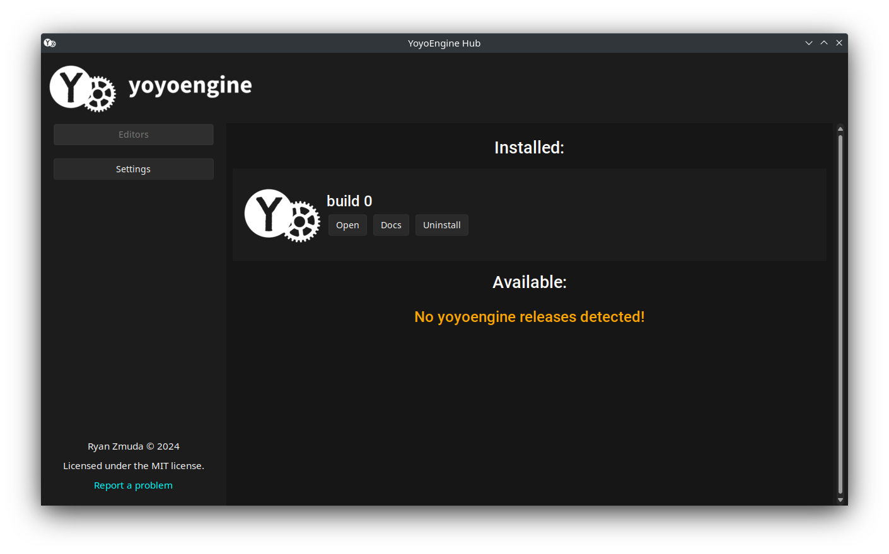

# yoyoengine hub


The yoyoengine hub (or launcher) is a clean standalone gui which allows you to manage multiple yoyoeditor installs.



## Installation

Pick one of the following:

### One-liner Install (recommended)

I've created a bash script `install.sh` which will handle downloading and creating a desktop entry for yoyoengine-hub.

You can run it from your terminal with the following command:

```bash
curl -sL https://raw.githubusercontent.com/yoyoengine/launcher/main/install.sh | sudo bash
```

If you wish to later uninstall, you can run the following command:

```bash
curl -sL https://raw.githubusercontent.com/yoyoengine/launcher/main/uninstall.sh | sudo bash
```

These scripts need sudo because they touch `/usr/bin` and `/usr/share/applications`. If this is scary for you, please check out the source code before running :)

### Standalone

You can download the latest release from the [releases page](https://github.com/yoyoengine/launcher/releases/latest).

Alternatively, here is a one liner to download and install the latest release:

```bash
curl -L $(curl -s https://api.github.com/repos/yoyoengine/launcher/releases/latest | jq -r '.assets[] | select(.name | endswith(".tar.gz")) | .browser_download_url') | tar -xz -C ~/.local/bin
```

This will place yoyoengine-hub in `~/.local/bin`, so to run it you can just run `yoyoengine-hub` from the terminal.

### Build from source

Assuming you have python3 and pip3, you can run the following commands:

```bash
git clone https://github.com/yoyoengine/launcher.git

cd launcher

pip install -r requirements.txt

pyinstaller --onefile --name yoyoengine-hub --collect-data sv_ttk --collect-data desktop_notifier --icon media/yoyoengine.ico --add-data "media/smallcleanlogo.png:." --add-data "media/cleanlogo.png:." --add-data "media/smallesttextlogo.png:." src/main.py
```

From there, you have a single elf binary in the `dist` directory.

## Running development build

Make sure you run from outside the source dir, with `--dev` as a cli arg to `main.py`.

```bash
python src/main.py --dev
```
